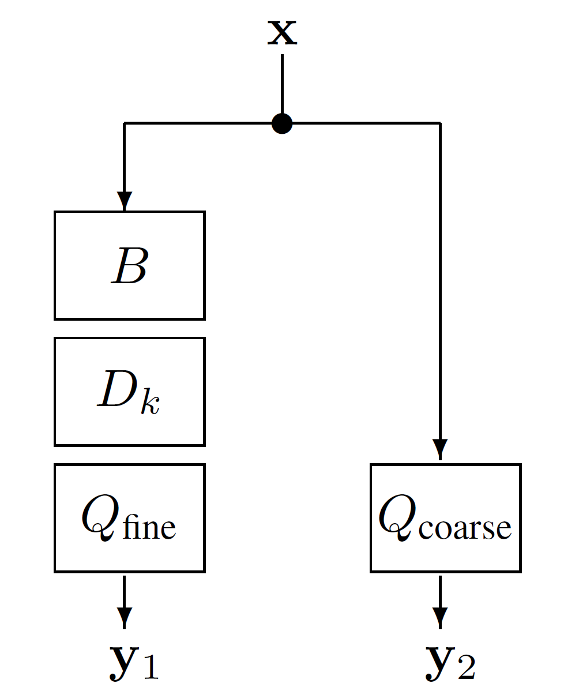

This file describes the MATLAB code and other files used in the article *Dequantization of a signal from two parallel quantized observations*.

The code has been developed in MATLAB version R2023a, and it relies on the [LTFAT](https://github.com/ltfat/ltfat/releases/tag/v2.6.0) toolbox (version 2.6.0).

In the root folder, there are two main m-files. The primary m-file is `dequantization_main.m`, and it runs a dequantization experiment.
Within this file, it is possible to change the input audio file (`audiofile`) and the bit depth of both acquisition branches (`param.w1`, `param.w2`) for the two quantized observations.
It is also possible to modify other parameters such as the STFT frame settings, number of iterations or general options of the Condat–Vu numerical algorithm.
The default values are those used in the experiments in the paper for the sake of reproducibility.

The other main file is `cp_main.m`, and it provides an alternative dequantization experiment using the Chambolle–Pock algorithm.
This method uses only one quantized observation with a single bit depth parameter (`param.w`) to compare the reconstruction results of both methods. 

The other files in the root folder contain support functions or tools for the dequantization algorithms such as the quantization of the signal or impulse response coefficients for filtering. 

The folder `test` contains the audio files used for experiments.
